<picture>
  <source media="(prefers-color-scheme: dark)" srcset="./assets/banner.svg">
  <source media="(prefers-color-scheme: light)" srcset="./assets/banner-light.svg">
  
</picture>

<h3 align="center">Ashwine Daniel &nbsp;·&nbsp; AI Developer</h3>

<i>"Turning ideas into intelligent AI solutions."</i>

  

---

### 🪪 ID Badge

  

---

### 💫 About Me

- ◆ Passionate AI Developer
- ◆ Loves building intelligent applications
- ◆ Always learning new technologies
- ◆ Open Source Enthusiast
- ◆ Clean Code Advocate

### 🧰 Tech Stack

---

### 📊 GitHub Stats

  
  

  

---

### 🐍 Contribution Snake

  <picture>
  <source media="(prefers-color-scheme: dark)" srcset="https://raw.githubusercontent.com/Ashwin2459Bh/Ashwin2459Bh/output/github-contribution-grid-snake-dark.svg">
<source media="(prefers-color-scheme: light)" srcset="https://raw.githubusercontent.com/Ashwin2459Bh/Ashwin2459Bh/output/github-contribution-grid-snake.svg">

  </picture>

Generated automatically by <code>.github/workflows/github-snake.yml</code> — updates daily.

